# 🌐 Full Stack Web Development Roadmap 🚀

Welcome to the ultimate roadmap and resources guide for becoming a **Full Stack Web Developer**. This guide will help you go from **zero to job-ready**, with curated content, tools, and projects.

---
 
## 📍 Visual Roadmap 

## 🧩 Full Stack Web Development Visual Roadmap
 
This flowchart outlines the **step-by-step journey** to become a Full Stack Web Developer. It includes frontend, backend, authentication, database, deployment, and optional AI integration—perfect for modern app builders.

```mermaid
flowchart TD
    A1["🖥️ Step 1: Frontend Development (HTML, CSS, JS, React/Next.js)"]
    A2["🔐 Step 2: Authentication (JWT, OAuth, Internet Identity)"]
    A3["🧠 Step 3: Backend Development (Node.js, Express, Rust, Canisters)"]
    A4["🗄️ Step 4: Database (MongoDB, PostgreSQL, Prisma)"]
    A5["📦 Step 5: API Handling & Logic (REST, GraphQL)"]
    A6["📂 Step 6: File Uploads & Media Management"]
    A7["🧠 Step 7: AI Integration (OpenAI, Gemini API, LangChain)"]
    A8["📊 Step 8: Search & Embedding (Vector DBs like Pinecone / Weaviate)"]
    A9["🧪 Step 9: Testing & Optimization (Jest, Cypress, Lighthouse)"]
    A10["🚀 Step 10: Deployment & DevOps (Vercel, Render, Docker, DFX)"]
    A11["🌐 BONUS: WebSockets, Streaming, Real-time Apps"]

    A1 --> A2
    A2 --> A3
    A3 --> A4
    A3 --> A5
    A5 --> A6
    A3 --> A7
    A7 --> A8
    A3 --> A9
    A9 --> A10
    A10 --> A11
```

---

## 🧠 Roadmap Overview

### 📌 Step 1: **HTML + CSS (Frontend Basics)**
- Learn how to structure webpages using HTML
- Style them using CSS (Flexbox & Grid are must!)
- Responsive Design (Media Queries)

**Best Resources:**
- [HTML + CSS - FreeCodeCamp](https://www.freecodecamp.org/learn/)
- [Responsive Web Design - MDN](https://developer.mozilla.org/en-US/docs/Learn/CSS/CSS_layout)

---

### 📌 Step 2: **JavaScript (JS) - The Language of the Web**
- Learn Variables, Loops, Functions, DOM, Events
- ES6+ Features (Arrow Functions, Spread, etc.)

**Best Resources:**
- [JavaScript Tutorial - JavaScript.info](https://javascript.info/)
- [Eloquent JavaScript Book](https://eloquentjavascript.net/)

---

### 📌 Step 3: **Version Control (Git & GitHub)**
- Track changes with Git
- Host your projects on GitHub
- Contribute to Open Source

**Best Resources:**
- [Git Handbook](https://guides.github.com/introduction/git-handbook/)
- [Git & GitHub Crash Course - YouTube](https://www.youtube.com/watch?v=RGOj5yH7evk)

---

### 📌 Step 4: **Frontend Framework - React**
- Learn Components, Props, State, Lifecycle Methods
- Hooks (`useState`, `useEffect`)
- Routing with React Router

**Best Resources:**
- [React Official Docs](https://reactjs.org/docs/getting-started.html)
- [React for Beginners - Scrimba](https://scrimba.com/learn/learnreact)

---

### 📌 Step 5: **Package Managers + Build Tools**
- NPM / Yarn
- Webpack / Vite (Modern JS Tooling)

**Best Resources:**
- [NPM Docs](https://docs.npmjs.com/)
- [Vite Official](https://vitejs.dev/)

---

### 📌 Step 6: **Styling Libraries & Frameworks**
- Tailwind CSS or Bootstrap
- Component Libraries like Shadcn/UI or Material UI

**Best Resources:**
- [TailwindCSS Docs](https://tailwindcss.com/docs)
- [Bootstrap Docs](https://getbootstrap.com/)

---

### 📌 Step 7: **Backend Basics (Node.js + Express)**
- REST APIs, Middleware, Routing
- Request/Response cycle

**Best Resources:**
- [Node.js Official Docs](https://nodejs.org/en/docs)
- [Express.js Guide](https://expressjs.com/)

---

### 📌 Step 8: **Databases (SQL + NoSQL)**
- Relational (MySQL / PostgreSQL)
- NoSQL (MongoDB)

**Best Resources:**
- [MongoDB University](https://university.mongodb.com/)
- [SQLBolt](https://sqlbolt.com/)

---

### 📌 Step 9: **Authentication & Security**
- JWT / OAuth
- Bcrypt, Helmet.js, CORS, HTTPS

**Best Resources:**
- [Auth0 Blog](https://auth0.com/blog/)
- [JWT Guide](https://jwt.io/introduction)

---

### 📌 Step 10: **DevOps & Deployment**
- Host frontend on Vercel / Netlify
- Host backend on Render / Railway / Heroku
- CI/CD basics

**Best Resources:**
- [Vercel Docs](https://vercel.com/docs)
- [Render Docs](https://render.com/docs)

---

## 🔧 Bonus Topics (Optional but Powerful)
| Area | Tools |
|------|------|
| TypeScript | TS + React |
| GraphQL | Apollo Server |
| Docker | Containers for apps |
| Prisma | ORM for databases |
| WebSockets | Real-time apps |
| Testing | Jest / Mocha / Cypress |
| State Management | Redux / Zustand |

---

## 🛠️ Project Ideas
- Personal Portfolio Website
- Blog App (MERN Stack)
- E-Commerce Site
- Chat App (Socket.io)
- Task Manager with Authentication

---

## 🧪 Practice Platforms
- [Frontend Mentor](https://www.frontendmentor.io/)
- [Codewars](https://www.codewars.com/)
- [LeetCode (for JS)](https://leetcode.com/problemset/all/?difficulty=Easy&status=Not%20Started&tags=javascript)

---

## 🔥 GitHub Repo Templates to Kickstart
- [React + Tailwind Starter](https://github.com/thedevdojo/tails)
- [Node.js Express Boilerplate](https://github.com/hagopj13/node-express-boilerplate)
- [MERN Stack Starter](https://github.com/HashirShoeb/MERN-Stack-Boilerplate)

---

## ✨ Inspiration
> "First make it work, then make it better, then make it beautiful."

---

## 🙌 Contribute
If you have suggestions, open an issue or a PR! Let’s build the best full-stack dev guide together.

---

## 📬 Connect with Me
- GitHub: [@YourUsername](https://github.com/YourUsername)
- Twitter: [@YourHandle](https://twitter.com/)
- Portfolio: [yourportfolio.com](https://yourportfolio.com)

